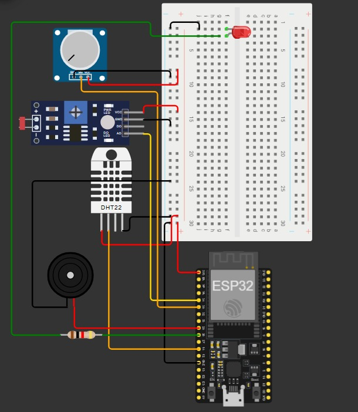
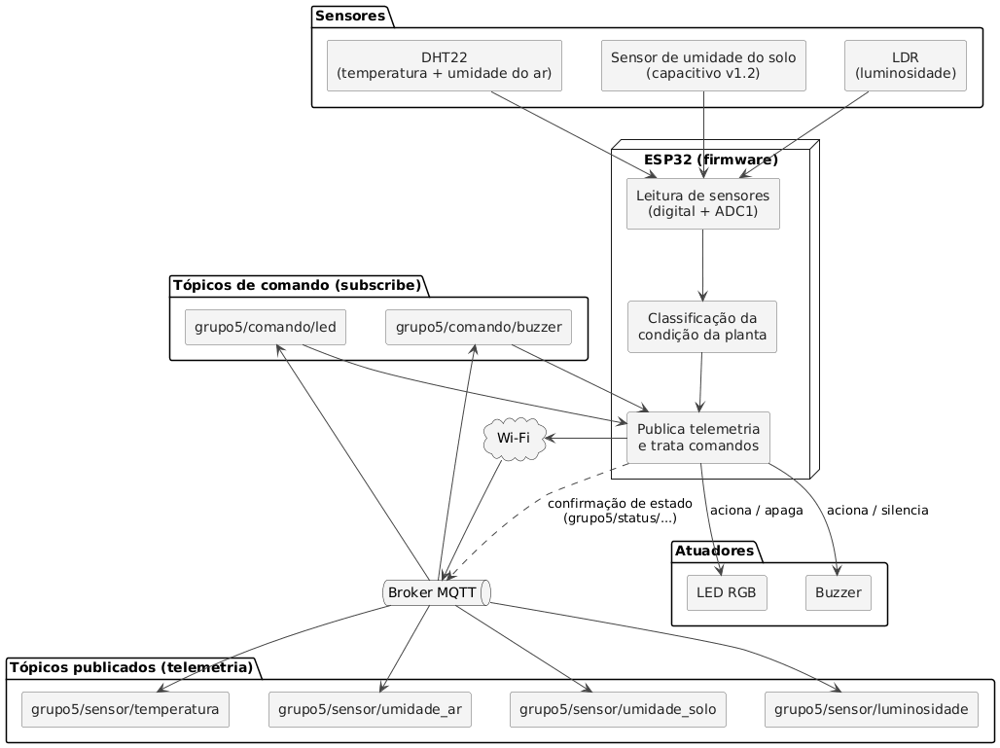

# Projeto IoT - Grupo 5 - Monitoramento Ambiental para Crescimento de Plantas

## Integrantes

- Ana Beatriz Pedrozo
- Daniela Luisa da Conceição
- Marcelo Gustavo Eger
- João Henrique Souza Rocha
- Leonardo André Ferreira
- Willian Squena

## Família temática

Grupo 5 - Qualidade Ambiental.

Construção de uma pequena estação ambiental conectada, que mede variáveis do ambiente relevantes para o crescimento de plantas, classifica a condição do local e sinaliza a condição por LED e buzzer.

## Problema

O crescimento saudável de uma planta depende de condições ambientais específicas — temperatura, umidade do ar, umidade do solo e luminosidade — que costumam variar ao longo do dia sem que o responsável pela planta perceba a tempo. Isso é ainda mais crítico em ambientes internos, estufas pequenas ou hortas domésticas, onde não há monitoramento automático: a pessoa só percebe que algo está errado (solo seco, pouca luz, calor excessivo) quando a planta já apresenta sinais visíveis de estresse, como murchamento ou folhas amareladas — quando muitas vezes já é tarde para reverter o dano.

## Usuário ou contexto de uso

Pessoas que cultivam plantas em casa, hortas domésticas ou pequenas estufas, e que não têm conhecimento técnico de agronomia nem tempo para checar manualmente as condições da planta todos os dias.

## Objetivo do Projeto

Construir um dispositivo com ESP32 que:

- leia pelo menos duas variáveis ambientais relevantes para plantas (temperatura, umidade do ar, umidade do solo e/ou luminosidade);
- classifique a condição do ambiente para o crescimento da planta;
- publique telemetria via MQTT;
- receba comando remoto;
- acione um alerta físico (LED e buzzer) e confirme a ação executada.

## Sensor e atuador reais

- **Sensor de temperatura e umidade do ar**: DHT22
- **Sensor de umidade do solo**: capacitivo, versão v1.2
- **Sensor de luminosidade**: LDR
- **Atuador/alerta**: LED RGB + Buzzer

## Hardware detalhado

- **Alimentação**: cabo USB conectado ao computador para os testes de bancada; possibilidade de uso de power bank 5V para demonstração fora da tomada.
- **Protoboard**: protoboard padrão de 830 pontos.
- **Estrutura/caixa**: suporte simples (impresso em 3D ou montado em caixa de papelão/acrílico) para fixar o ESP32 e os sensores próximo ao vaso da planta.
- **Conectores**: jumpers macho-macho e macho-fêmea; resistor em série com o LED (conforme orientação de segurança do guia da disciplina).
- **Observação técnica de pinagem**: o ESP32 possui duas famílias de pinos analógicos (ADC1 e ADC2). Como o ADC2 fica instável quando o Wi-Fi está ativo, o sensor de umidade do solo e o LDR serão conectados a pinos **ADC1** (faixa GPIO32–GPIO39), já que o projeto depende de Wi-Fi ativo o tempo todo para o MQTT.

## Protótipo do produto



Circuito simulado no Wokwi, com o ESP32 conectado aos sensores e atuadores via protoboard, seguindo a pinagem definida: DHT22 no GPIO14, sensor de solo e LDR nos pinos ADC1 (GPIO34 e GPIO35), buzzer no GPIO25 e LED (com resistor em série) no GPIO26.

**Observações sobre o protótipo simulado (diferenças em relação ao hardware físico final):**

- **Potenciômetro no lugar do sensor de umidade do solo**: o Wokwi não possui o sensor capacitivo de solo na biblioteca de peças, então o potenciômetro foi usado para simular a leitura analógica que esse sensor produziria. A lógica de leitura e o pino (GPIO35) são os mesmos que serão usados com o sensor real.
- **Módulo LDR com placa comparadora no lugar do LDR puro**: o componente usado no simulador é um módulo pronto (com potenciômetro de sensibilidade e saída digital/analógica). O hardware final pode usar apenas o LDR em um divisor de tensão simples, mais próximo do previsto originalmente.
- **LED simples no lugar do LED RGB**: o protótipo simulado usa um LED de uma cor. Caso o hardware final utilize um LED RGB, serão necessários 3 pinos GPIO com resistor (um por cor), em vez de apenas o GPIO26.
- **DHT22**: é o único componente idêntico ao que será usado no hardware físico, sem substituições.
- **Buzzer**: no protótipo é ligado diretamente ao GPIO25; dependendo do modelo real (ativo ou passivo), pode ser necessário um transistor ou resistor adicional.

## Arquitetura específica
\


O ESP32 lê os três sensores (DHT22 via pino digital; solo e LDR via ADC1), classifica a condição da planta e publica telemetria em quatro tópicos MQTT:

```
grupo5/sensor/temperatura
grupo5/sensor/umidade_ar
grupo5/sensor/umidade_solo
grupo5/sensor/luminosidade
```

Ao mesmo tempo, assina dois tópicos de comando:

```
grupo5/comando/led
grupo5/comando/buzzer
```

Ao receber um comando, o firmware aciona o atuador correspondente (LED ou buzzer) e publica a confirmação do estado em um tópico de status (grupo5/status/...).

## Backlog reescrito

| Tarefa | Responsável | Status |
|---|---|---|
| Criar repositório | Daniela | Feito |
| Preencher README inicial | Daniela e João | Feito |
| Testar ESP32 com LED | Marcelo | A fazer |
| Identificar sensor principal (DHT22 e LDR) | Willian | A fazer |
| Testar sensor de umidade do solo | Willian | A fazer |
| Listar componentes necessários | Leonardo | Incompleto |
| Desenhar arquitetura inicial | Ana | A fazer |
| Registrar primeiro risco técnico | Daniela | Feito |
| Implementar leitura do DHT22 (temperatura/umidade do ar) | Leonardo | A fazer |
| Implementar leitura do sensor de solo e do LDR nos pinos ADC1 | Ana | A fazer |
| Definir e testar limites de classificação (seco/úmido, escuro/claro) | Ana | A fazer |
| Conectar ESP32 ao Wi-Fi | João | A fazer |
| Conectar ao broker MQTT e publicar telemetria | Willian | A fazer |
| Implementar assinatura dos tópicos de comando (LED/buzzer) | Marcelo | A fazer |
| Implementar confirmação de estado após comando | Leonardo | A fazer |
| Implementar lógica de reconexão (Wi-Fi/broker) | Daniela | A fazer |
| Montar circuito completo em protoboard | Marcelo | A fazer |
| Testar demonstração funcional de ponta a ponta | João | A fazer |

## Primeiro risco técnico (revisado)

Os sensores de umidade do solo e de luminosidade (LDR) são analógicos e dependem do ADC do ESP32 para conversão em valores utilizáveis. A leitura bruta pode variar significativamente conforme o tipo de solo, a profundidade de inserção do sensor e as condições de luz ambiente ao redor do LDR, exigindo calibração de valores mínimos e máximos (mapeamento do ADC para uma escala de "seco/úmido" e "escuro/claro") antes que a classificação da condição da planta seja confiável. Além disso, esses sensores precisam ser conectados a pinos ADC1 do ESP32, já que o ADC2 é instável durante o uso simultâneo do Wi-Fi.

## Feedback da Aula 04

Conversa individual com o professor ainda não realizada nesta aula.
